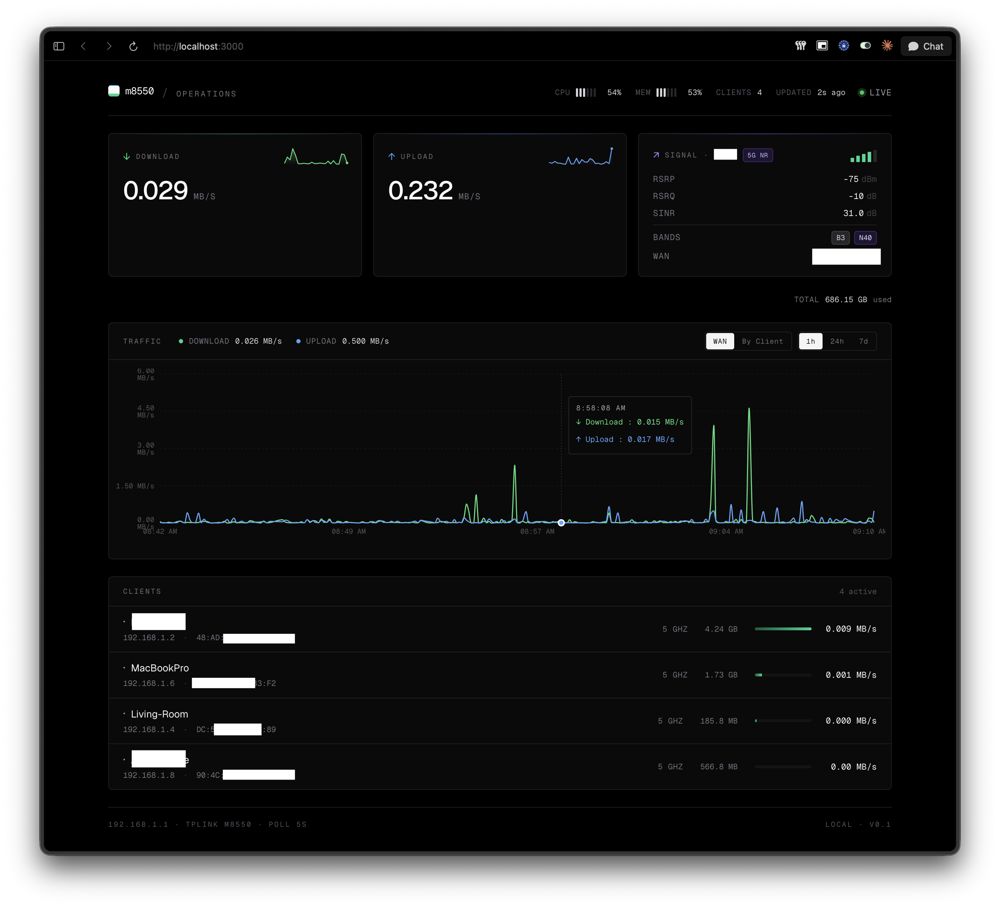

# M8550 Monitor



A self-hosted ops dashboard for the **TP-Link M8550 5G mobile router**. Polls the router's local CGI every 5 seconds and shows live download / upload rates, a 1h / 24h / 7d traffic chart with WAN and per-client breakdown modes, connected-clients with their bandwidth, real 5G NR signal metrics (SS-RSRP / SS-RSRQ / SS-SINR), and host system stats (CPU / memory / total data used).

Two Docker Compose services share one SQLite file: a Python collector that polls and writes, and a Next.js dashboard that reads.

> **Heads up — works on the M8550 specifically.** The router client uses
> `tplinkrouterc6u`'s `TPLinkEXClient` adapter, with M8550-specific quirks
> (username hardcoded to `user`, signal data fetched from
> `DEV2_LTE_SERVING_CELL_INFO`, etc.). Other TP-Link "EX-platform" mobile
> routers (M-series, MR-line, Deco LTE) likely work or need only small
> tweaks; consumer Archer / Deco WiFi routers without an LTE/5G modem
> will not. PRs welcome to broaden support.

## Requirements

- Docker Desktop (or Docker Engine + `docker compose`)
- Connected to the M8550's Wi-Fi (the collector reaches it at `192.168.1.1`)
- The router's local-management password

## Quick start

```bash
git clone https://github.com/<you>/<repo>.git
cd <repo>
cp .env.example .env
# edit .env — set M8550_PASSWORD
docker compose up --build -d
```

Open <http://localhost:3000>.

```bash
docker compose logs -f       # tail logs
docker compose down          # stop
```

## What you get

- **Live rates** — Download / Upload, per second, all in MB/s with sparklines.
- **Traffic chart** — Toggle between *WAN* (↓ / ↑ split, two areas) and *By Client* (stacked area, one colour per device). Range selector: 1h · 24h · 7d.
- **Signal panel** — 5G NR SS-RSRP / SS-RSRQ / SS-SINR with bars, falls back to LTE RSRP / RSRQ / SNR when no NR cell. Plus carrier name, connected bands (e.g. `B3 + N40`), WAN IPv4.
- **System gauges** — Router CPU and memory utilisation, threshold-coloured.
- **Total used** — Cumulative WAN bytes since the router's monthly counter rolled over.
- **Clients table** — Name, IP, MAC, band (2.4G / 5G / wired), and per-client combined bandwidth. Sorted busiest-first.
- **Status pill** — Live (green pulse) / Stale (Ns) / Router offline. Auto-recovers when the router drops the session.

## Known data limitations on M8550 firmware

| Field | Status |
|---|---|
| WAN ↓ / ↑ rates | from `cur_rx_speed` / `cur_tx_speed` directly |
| Per-client RX / TX split | not exposed — firmware only gives a single combined `totalBytes` per MAC. The dashboard derives a single ↕ bandwidth value via deltas. |
| 5G NR signal (SS-RSRP / SS-RSRQ / SS-SINR) | from `DEV2_LTE_SERVING_CELL_INFO` (the obvious `DEV2_LTE_NET_STATUS.rfInfoRsrp` always returns 0; we use the serving-cell endpoint instead) |
| LTE anchor signal (RSRP / RSRQ / SNR) | from the same endpoint |
| Username | must be `"user"`, not `"admin"`. Hardcoded. |

The recon notes that drove these decisions are in [`docs/recon.md`](docs/recon.md) — useful reading if you want to extend support to a sibling firmware.

## Architecture

```
┌──────────────────────────┐      ┌──────────────────────────┐
│  collector (Python)      │      │  web (Next.js 15)        │
│                          │      │                          │
│  tplinkrouterc6u client ─┼──┐   │  app router pages        │
│  poller (5s)             │  │   │  api routes              │
│       │                  │  │   │       │                  │
│       ▼                  │  │   │       ▼                  │
│  store (sqlite write)    │  │   │  better-sqlite3 (RO)     │
└──────────┬───────────────┘  │   └──────────┬───────────────┘
           │ writes           │              │ reads
           ▼                  │              ▼
        ┌─────────────────────┴──────────────┐
        │  data/m8550.db  (SQLite, WAL)      │
        └────────────────────────────────────┘

  collector ⇄ http://192.168.1.1   browser ⇄ http://localhost:3000
```

- **Collector** authenticates once, then re-authorizes transparently on session drops (the M8550 invalidates other sessions when the Tether app logs in). Writes a sample every 5s.
- **Web** opens the SQLite file read-only via `better-sqlite3`. WAL mode lets reader and writer coexist without locking.

## Development

Native run for faster iteration:

```bash
# collector
cd collector
M8550_HOST=http://192.168.1.1 M8550_PASSWORD=... \
  DB_PATH=../data/m8550.db uv run python -m m8550_collector

# web
cd web
DB_PATH=../data/m8550.db pnpm dev
```

## Tests

```bash
cd collector && uv run pytest    # 41 tests
cd web && pnpm test              # 13 tests
```

## Layout

```
collector/                   # Python daemon
  src/m8550_collector/
    router.py                # tplinkrouterc6u adapter
    poller.py                # 5s loop
    store.py                 # SQLite schema + writes
    rate.py                  # pure rate calculation
    config.py                # env-var parsing
    __main__.py              # entry point
  tests/                     # pytest

web/                         # Next.js 15 dashboard
  app/
    page.tsx                 # dashboard
    api/{current,history}/route.ts
  components/                # rate-card, signal-panel, traffic-chart, ...
  lib/                       # types, db, format, downsample

data/                        # sqlite (gitignored, created at runtime)
docs/
  superpowers/{specs,plans}/ # design + plan docs
  recon.md                   # endpoint reverse-engineering notes
recon/                       # standalone exploration scripts (read-only)
```

## Tech stack

Python 3.12 · `tplinkrouterc6u` · Next.js 15 (App Router) · TypeScript · `better-sqlite3` · Recharts · Tailwind v4 · Docker Compose · Geist font.

## Acknowledgements

- [`tplinkrouterc6u`](https://github.com/AlexandrErohin/TP-Link-Archer-C6U) for the auth + decryption work that makes the local CGI accessible at all.
- TP-Link for shipping a router whose web UI bundles a delightfully greppable `oid_str.js`.

## License

[MIT](LICENSE).
